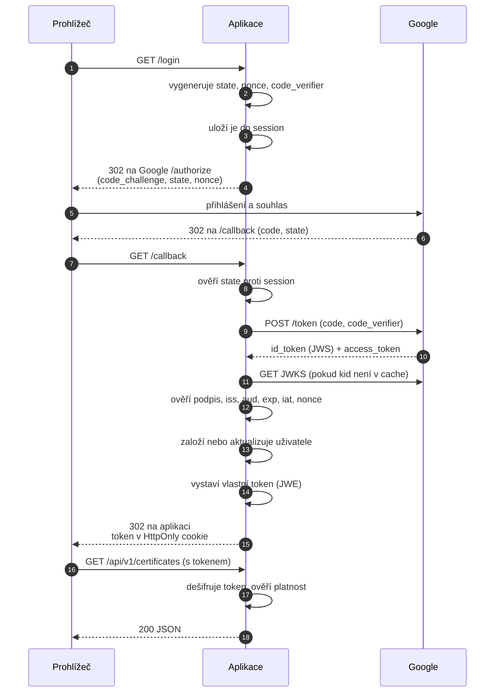

# 03 — Návrh řešení

**Projekt:** oidc-pkce-jwe-demo
**Navazuje na:** `01-analyza-pozadavku.md`, `02-omezeni-prostredi.md`

---

## 1. Základní myšlenka návrhu

Aplikace vystupuje ve **dvou rolích současně**. Toto rozdělení je nosným rozhodnutím
celého návrhu a určuje strukturu zbytku dokumentu.

**Role A — Relying Party.** Vůči Googlu je aplikace klientem. Neověřuje uživatele sama,
pouze přijímá a ověřuje tvrzení o identitě, které vydal někdo jiný. Naplňuje FR-01.

**Role B — Vydavatel aplikačního tokenu.** Po ověření identity si aplikace vystaví
**vlastní** token, kterým pak autorizuje volání svého API. Naplňuje FR-10 a NFR-05.

Toto rozdělení není samoúčelné. Kdyby aplikace používala token od Googlu i pro přístup
ke svému API, musela by při každém požadavku volat externí systém, byla by závislá na
jeho dostupnosti a nemohla by do tokenu vložit vlastní identifikátor uživatele. Vlastní
token tyto vazby přeruší.

Rozhodnutí je zaznamenáno v `adr/0001-rozdeleni-roli.md`.

---

## 2. Komponenty

| Komponenta | Odpovědnost |
|---|---|
| **Front controller** | Jediný vstupní bod, směrování požadavků, zachycení výjimek. |
| **OIDC klient** | Discovery, sestavení autorizačního požadavku, výměna kódu za token, ověření `id_token`. |
| **Správa klíčů poskytovatele** | Stahování a cachování sady veřejných klíčů Googlu s reakcí na rotaci. |
| **Vydavatel tokenu** | Vystavení a ověření vlastního šifrovaného tokenu. |
| **Zpracování certifikátu** | Parsování PEM, extrakce údajů, vyhodnocení platnosti. |
| **Repozitáře** | Přístup k databázi, vždy přes připravené dotazy. |
| **API vrstva** | Kontrola tokenu, vlastnická autorizace, serializace odpovědí a chyb. |

Aplikace nepoužívá aplikační framework. Důvod je v `adr/0005-bez-frameworku.md`.

---

## 3. Přihlašovací tok

**Klíčové body toku**

- `state` i `code_verifier` jsou vázány na serverovou session. Callback bez odpovídající
  session je odmítnut — chrání proti CSRF (NFR-03).
- `nonce` se ukládá do session a porovnává s hodnotou v `id_token` — chrání proti přehrání.
- Sada klíčů Googlu se cachuje, ale **neznámý identifikátor klíče vyvolá její obnovení**.
  Bez toho by rotace klíčů na straně Googlu způsobila výpadek přihlašování (NFR-04).
- `access_token` od Googlu aplikace nepoužívá — nepotřebuje volat jeho API. Uchovávat jej
  by znamenalo držet oprávnění, které nikdo nevyužije.

---

## 4. Tokeny

V řešení vystupují **dva tokeny s odlišným účelem a odlišnou ochranou**. Jejich rozlišení
je jádrem bezpečnostní části návrhu.

| | `id_token` od Googlu | Vlastní aplikační token |
|---|---|---|
| **Formát** | JWS — podepsaný | JWE — šifrovaný |
| **Vydavatel** | Google | aplikace |
| **Účel** | tvrzení o identitě | oprávnění k přístupu k API |
| **Chráněná vlastnost** | integrita a původ | důvěrnost |
| **Čitelnost obsahu** | veřejná | pouze pro aplikaci |
| **Platnost** | dle poskytovatele | 15 minut |
| **Přenos** | jednorázově, server–server | opakovaně, cookie |

**Proč u prvního stačí podpis.** Obsah `id_token` není tajemstvím — jméno a e-mail
uživatel Googlu sám poskytl. Rozhodující je, že tvrzení nesmí nikdo zfalšovat, a to
zajistí podpis.

**Proč u druhého podpis nestačí.** Vlastní token nese interní identifikátor uživatele
a putuje opakovaně přes prohlížeč. Podepsaný, ale čitelný token by komukoli s přístupem
k zařízení nebo k logu proxy prozradil strukturu interních dat. Zde je požadována
důvěrnost, tedy šifrování.

Použité schéma je `alg=dir` se symetrickým klíčem a `enc=A256GCM`. Token vydává i ověřuje
tatáž aplikace, takže asymetrická varianta by přidala složitost bez přínosu.
Viz `adr/0006-dir-a256gcm.md`.

**Obsah vlastního tokenu:** `iss`, `sub` (interní identifikátor uživatele), `iat`, `exp`,
`jti`. Jméno ani e-mail v tokenu nejsou — API je umí načíst z databáze a token tak nenese
osobní údaje nad rámec nezbytného (NFR-07).

---

## 5. Autorizační model

Aplikace pracuje se **dvěma odlišnými kategoriemi dat**, na které se uplatňují různá
pravidla. Toto rozlišení plyne z FR-10 a FR-11 a musí být v kódu explicitní, nikoli
implicitní.

| Kategorie | Entity | Pravidlo |
|---|---|---|
| **Vlastněná data** | certifikát, kontrola platnosti | Uživatel vidí a mění výhradně své záznamy. |
| **Sdílené číselníky** | certifikační autorita, účel klíče | Čitelné pro všechny přihlášené uživatele. |

Vlastnictví se **nekontroluje až u výsledku, ale je součástí dotazu** — repozitář
certifikátů nemá metodu „najdi podle identifikátoru", pouze „najdi podle identifikátoru
a vlastníka". Tím je vyloučeno, že by kontrola byla někde opomenuta.

Požadavek na cizí záznam vrací **404, nikoli 403**. Odpověď 403 by potvrdila, že záznam
s daným identifikátorem existuje, což je únik informace. Viz `adr/0007-404-misto-403.md`.

Certifikační autority vznikají automaticky při prvním výskytu, párované na rozlišovací
jméno subjektu. **Nepatří uživateli, který je založil** — jinak by dva uživatelé
s certifikáty od téže autority vytvořili duplicitní záznamy a číselník by ztratil smysl.

---

## 6. Zpracování certifikátu

Certifikát vstupuje jako **text ve formátu PEM** v těle požadavku. Nejde o nahrávání
souboru, čímž odpadá celá bezpečnostní problematika ukládání a spouštění nahraného obsahu.

**Postup zpracování**

1. Kontrola, že vstup je syntakticky platný PEM a lze jej rozparsovat. Neplatný vstup
   končí odpovědí 422 s popisem chyby (FR-12).
2. Kontrola, že vstup **neobsahuje soukromý klíč**. Pokud ano, požadavek je odmítnut
   a obsah se nikam nezaznamenává, ani do logu.
3. Extrakce údajů: subjekt, vydavatel, sériové číslo, platnost od–do, algoritmy,
   délka klíče, otisk SHA-256.
4. Dohledání nebo založení certifikační autority podle rozlišovacího jména vydavatele.
5. Dohledání nebo založení účelů klíče a jejich navázání na certifikát.
6. Provedení první kontroly platnosti a zápis do historie.

**Kontrola platnosti** porovnává aktuální čas s rozsahem platnosti certifikátu a vrací
jeden ze stavů: platný, dosud neplatný, po expiraci. Aplikace **neověřuje odvolání ani
řetěz důvěry** — to je mimo rozsah studie a je to výslovně uvedeno v dokumentaci
i v odpovědi API, aby nevznikl dojem plnohodnotné validace.

Kontrola je samostatnou operací s vlastní historií, protože její výsledek závisí na čase
(FR-09). Certifikát platný při vložení může být při pozdější kontrole po expiraci.

---

## 7. Rozhraní API

Rozhraní je popsáno specifikací OpenAPI 3.1 a vyzkoušitelné přes Swagger UI (FR-13).

| Metoda | Cesta | Naplňuje |
|---|---|---|
| GET | `/api/v1/me` | FR-03 |
| GET | `/api/v1/certificates` | FR-07 |
| POST | `/api/v1/certificates` | FR-05, FR-06 |
| GET | `/api/v1/certificates/{id}` | FR-08 |
| POST | `/api/v1/certificates/{id}/checks` | FR-09 |
| GET | `/api/v1/authorities` | FR-11 |

**Verzování** je v cestě (`/api/v1/`). Verze je viditelná v logu i v příkazu curl,
umožňuje souběžný provoz více verzí a nekomplikuje cachování. Viz
`adr/0008-verzovani-api.md`.

**Chybové odpovědi** používají formát RFC 7807 (`application/problem+json`) — NFR-06.
Formát je ve specifikaci definován jako sdílené schéma. Používané stavy: 400 neplatný
požadavek, 401 chybějící nebo neplatný token, 404 neexistující nebo cizí záznam,
422 selhání validace vstupu, 500 interní chyba s korelačním identifikátorem.

---

## 8. Datový model

Podrobně v `04-datovy-model.md`. Přehledově šest tabulek:

- `oidc_user` — uživatel párovaný na `sub` od Googlu
- `oidc_certificate` — certifikát, vlastněný uživatelem, vydaný autoritou
- `oidc_certificate_authority` — sdílený číselník autorit
- `oidc_key_usage` — sdílený číselník účelů klíče
- `oidc_certificate_key_usage` — vazební tabulka M:N
- `oidc_certificate_check` — historie kontrol platnosti

Model obsahuje vazby 1:N i M:N a rozlišuje vlastněná data od sdílených číselníků, což
je přímý důsledek autorizačního modelu z kapitoly 5.

---

## 9. Vliv omezení prostředí na návrh

Omezení jsou rozebrána v `02-omezeni-prostredi.md`. Návrh na ně reaguje takto:

| Omezení | Reakce návrhu |
|---|---|
| PHP 8.1 na produkci, 8.2 ve vývoji | Cílem je nižší verze; verze je uzamčena v konfiguraci správce závislostí. |
| Zakázané systémové funkce | Závislosti se sestavují mimo produkci. Nasazení je pouhé nahrání souborů. |
| Reverse proxy hlásí nešifrované spojení | Jediná komponenta sestavuje absolutní adresy z hlaviček od proxy. Nikde jinde se adresa neskládá. |
| Nedostupný systémový log | Aplikace zapisuje vlastní log mimo veřejný adresář. |
| Nevhodné výchozí nastavení session | Parametry cookie jsou nastaveny explicitně v aplikaci i konfiguračním souborem. |

Nastavení `SameSite=Lax` je záměrné, nikoli kompromis: návrat od Googlu je nadřazený
požadavek metodou GET, u kterého by hodnota `Strict` cookie neodeslala a ověření `state`
by selhalo. Viz `adr/0004-samesite-lax.md`.

---

## 10. Vědomá omezení návrhu

Následující vlastnosti nejsou nedostatkem implementace, ale důsledkem návrhu nebo
prostředí. Jsou uvedeny, aby nebyly objeveny jako překvapení.

- **Odhlášení ruší pouze lokální session a vlastní token.** Google nenabízí plnohodnotné
  odhlášení iniciované klientem, uživatel tedy zůstává přihlášen u poskytovatele.
- **Vydaný token nelze zneplatnit před jeho expirací.** Řešením by byl seznam
  zneplatněných tokenů; při patnáctiminutové platnosti je riziko přijatelné.
- **Výpadek Googlu znemožní přihlášení.** Aplikace nemá záložního poskytovatele identity.
- **Platnost certifikátu se posuzuje pouze podle časového rozsahu.** Odvolání ani řetěz
  důvěry se neověřuje.

---

## 11. Přehled rozhodnutí

| Záznam | Rozhodnutí |
|---|---|
| ADR-0001 | Rozdělení rolí: Relying Party a vydavatel vlastního tokenu |
| ADR-0002 | PKCE i u klienta, který má tajemství |
| ADR-0004 | `SameSite=Lax` místo `Strict` |
| ADR-0005 | Bez aplikačního frameworku |
| ADR-0006 | `dir` + `A256GCM` místo asymetrického šifrování |
| ADR-0007 | 404 místo 403 u cizích záznamů |
| ADR-0008 | Verzování API v cestě |
