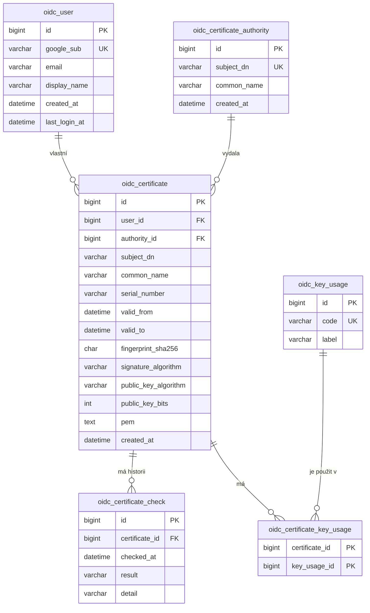

# 04 — Datový model

**Projekt:** oidc-pkce-jwe-demo
**Navazuje na:** `03-navrh-reseni.md`
**Fyzické schéma:** `database/schema.sql`

---

## 1. Přehled

| Entita | Význam |
|---|---|
| `oidc_user` | Uživatel párovaný na účet u poskytovatele identity. |
| `oidc_certificate` | Certifikát evidovaný uživatelem. |
| `oidc_certificate_authority` | Sdílený číselník vydávajících autorit. |
| `oidc_key_usage` | Sdílený číselník účelů klíče. |
| `oidc_certificate_key_usage` | Vazba M:N mezi certifikátem a účely klíče. |
| `oidc_certificate_check` | Historie kontrol platnosti. |

Úplný výčet sloupců včetně typů je ve `database/schema.sql`. Tento dokument popisuje
**proč je model takový, jaký je**.

---

## 2. Kategorie dat

Model rozlišuje dvě kategorie s **různými autorizačními pravidly**. Rozdělení plyne
z FR-10 a FR-11 a je hlavním důvodem, proč nelze vlastnictví kontrolovat plošně.

| Kategorie | Tabulky | Pravidlo |
|---|---|---|
| **Vlastněná data** | `oidc_certificate`, `oidc_certificate_check` | Přístupné pouze vlastníkovi. |
| **Sdílené číselníky** | `oidc_certificate_authority`, `oidc_key_usage` | Čitelné pro všechny přihlášené. |
| **Identita** | `oidc_user` | Uživatel vidí pouze vlastní záznam. |

Vazební tabulka se řídí vlastnictvím certifikátu.

---

## 3. Rozhodnutí v modelu

**Párování uživatele na `google_sub`, nikoli na e-mail** (FR-02). Uživatel si může
adresu u poskytovatele změnit, identifikátor `sub` je neměnný. Důsledkem je, že **e-mail
není unikátní** — vynucení unikátnosti by bylo v rozporu s významem sloupce.

**Autorita nemá vlastníka.** Kdyby se vázala na uživatele, který ji vložil jako první,
vznikaly by při dalších certifikátech od téže autority duplicity a číselník by ztratil
smysl. Autorita vzniká automaticky při prvním výskytu, párovaná na rozlišovací jméno.

**Sériové číslo je textové, nikoli číselné.** Sériové číslo X.509 může mít až 20 bajtů
a do celočíselného typu se nevejde. Uložení jako číslo by vedlo k přetečení a tichému
znehodnocení dat.

**Původní podoba certifikátu se uchovává.** Umožňuje pozdější doplnění údajů, které model
dnes neeviduje, bez nutnosti žádat uživatele o opětovné vložení. Jde o veřejnou část,
uložení tedy nepředstavuje riziko.

**Vazba M:N je věcně odůvodněná.** Certifikát má typicky více účelů klíče současně
a tentýž účel se vyskytuje u mnoha certifikátů. Vazební tabulka nenese vlastní údaje,
proto je primárním klíčem dvojice cizích klíčů.

**Historie kontrol je samostatnou entitou**, protože výsledek závisí na čase (FR-09).
Certifikát platný při vložení může být při pozdější kontrole po expiraci. Model uchovávající
pouze aktuální stav by tuto informaci ztratil.

**Výsledek kontroly je text, nikoli výčtový typ databáze.** Rozšíření výčtu v MySQL
vyžaduje změnu struktury tabulky, což je na hostingu bez příkazové řádky nepraktické.
Sada hodnot je definována v aplikaci.

**Časové sloupce jsou `DATETIME` v UTC, nikoli `TIMESTAMP`.** Typ `TIMESTAMP` přepočítává
hodnoty podle časové zóny relace; server má středoevropskou zónu, aplikace pracuje v UTC.
U evidence, jejímž smyslem je zaznamenat, kdy k čemu došlo, by šlo o závažnou chybu.

---

## 4. Integrita a indexy

| Omezení | Zdůvodnění |
|---|---|
| Unikátní `(user_id, fingerprint_sha256)` | Tentýž veřejný certifikát smí evidovat více uživatelů, jeden uživatel jej však nevloží dvakrát. Globální unikát by byl chybou. |
| Mazání uživatele a kontrol kaskádou | Data bez vlastníka nebo bez certifikátu nemají smysl. |
| Mazání autority omezeno | Smazání sdíleného číselníku nesmí odstranit certifikáty cizích uživatelů. |

**Indexy nad vlastněnými daty začínají vždy `user_id`**, protože žádný dotaz nad nimi
se neobejde bez podmínky na vlastníka — přímý důsledek autorizačního modelu z kapitoly 5
návrhu.

---

## 5. Vědomá zjednodušení

- **Odvolání certifikátů se neeviduje.** Ověřování odvolání je mimo rozsah studie.
- **Řetěz důvěry se nemodeluje.** Vazba na autoritu je jednoúrovňová; kořenové
  a mezilehlé autority se nerozlišují.
- **Alternativní jména držitele se neevidují.** Další vazba 1:N bez přínosu pro cíl studie.
